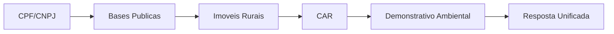

# DadosFazenda Data API

A DadosFazenda Data API permite consultar dados de propriedades rurais brasileiras de forma unificada, cruzando informacoes de diversas bases publicas oficiais.

## O que voce pode fazer

<CardGroup cols={2}>
  <Card title="Busca por CPF/CNPJ" icon="magnifying-glass" href="/api-reference/busca-por-cpf">
    A partir de um CPF ou CNPJ, descubra todas as propriedades rurais vinculadas, com dados cadastrais, CAR e demonstrativo ambiental.
  </Card>
  <Card title="Mais endpoints em breve" icon="rocket">
    Estamos expandindo a API com novas consultas de dados rurais.
  </Card>
</CardGroup>

## Dados retornados

A API retorna informacoes consolidadas de cada propriedade rural:

| Categoria | Dados |
|-----------|-------|
| **Imovel Rural** | Denominacao, municipio, UF, area total, classificacao fundiaria, titulares |
| **CCIR** | Numero, situacao, data de vencimento, modulos fiscais |
| **CAR** | Codigo, status, tipo, condicao de analise |
| **Demonstrativo Ambiental** | Reserva legal, APP, vegetacao nativa, uso consolidado, areas de uso restrito, sobreposicoes |

## Como funciona

A API consulta bases publicas oficiais, identifica os imoveis rurais vinculados ao documento, localiza o Cadastro Ambiental Rural (CAR) correspondente e retorna os dados ambientais detalhados em uma unica resposta.
