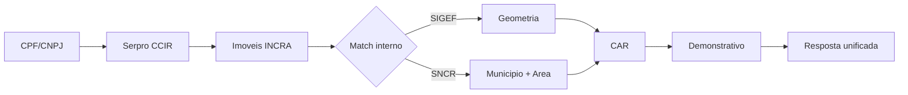

# DadosFazenda Data API

A DadosFazenda Data API permite consultar dados de propriedades rurais brasileiras de forma unificada, cruzando informacoes de diversas fontes oficiais.

## O que voce pode fazer

<CardGroup cols={2}>
  <Card title="Busca por CPF/CNPJ" icon="magnifying-glass" href="/api-reference/busca-por-cpf">
    A partir de um CPF ou CNPJ, descubra todas as propriedades rurais vinculadas, com dados do INCRA, CAR e demonstrativo ambiental.
  </Card>
  <Card title="Mais endpoints em breve" icon="rocket">
    Estamos expandindo a API com novas consultas de dados rurais.
  </Card>
</CardGroup>

## Fontes de dados

A API cruza automaticamente informacoes de:

| Fonte | Dados |
|-------|-------|
| **Serpro / INCRA** | Imoveis rurais vinculados ao CPF/CNPJ, dados do CCIR (area, titulares, classificacao fundiaria) |
| **SIGEF** | Parcelas georreferenciadas certificadas pelo INCRA |
| **SNCR** | Sistema Nacional de Cadastro Rural |
| **CAR** | Cadastro Ambiental Rural (codigo, municipio, status, area) |
| **Demonstrativo CAR** | Reserva legal, APP, vegetacao nativa, uso consolidado, sobreposicoes |

## Como funciona

